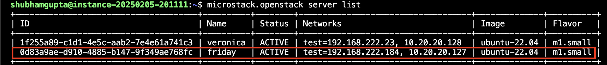
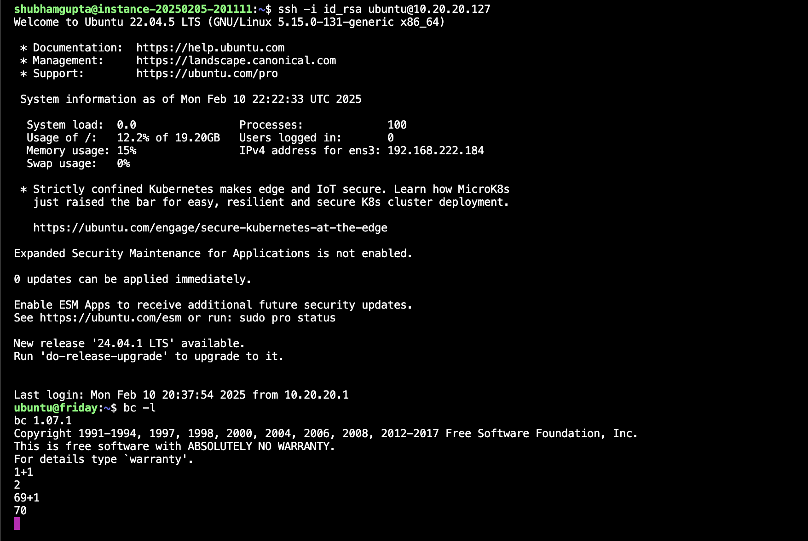

# Calculator App

## 1. SSH into the instance and microstack
- Install microstack
```bash
sudo snap install microstack --devmode --beta
```
- Setup microstack

## 2. Create a ssh key pair
- Create a ssh key pair
```bash
ssh-keygen -t rsa -b 4096 -N "" -f ~/.ssh/id_rsa
```
- Add the public key to the instance
```bash
microstack.openstack keypair create --public-key ~/.ssh/id_rsa.pub <key-name>
```

## 3. Create an ubuntu instance
- Download Ubuntu image
```bash
wget https://cloud-images.ubuntu.com/jammy/current/jammy-server-cloudimg-amd64.img -O ubuntu-22.04.img
```
- Add the Image to microstack
```bash
microstack.openstack image create --file ubuntu-22.04.img \
  --disk-format qcow2 --container-format bare --public \
  --property hw_disk_bus=scsi --property hw_scsi_model=virtio-scsi ubuntu-22.04
```
- Create An Instance (Assign atleast m1.small flavor for ubuntu instances)
```bash
microstack.openstack server create --flavor m1.small \
  --image ubuntu-22.04 --network test --security-group default \
  --key-name <key-name> <name of the instance>
```


## 4. Assign a floating IP to the instance
- Create a floating IP
```bash
microstack.openstack floating ip create external
```
- Associate the floating IP to the instance
```bash
microstack.openstack server add floating ip <name of the instance> <floating-ip>
```



## 5. SSH into the instance
- SSH into the instance
```bash
ssh -i ~/.ssh/id_rsa ubuntu@<floating-ip>
```

## 6. Install the calculator app
- Install the calculator app
```bash
sudo apt update
sudo apt install bc
```

## 7. Run the calculator app
- Run the calculator app
```bash
bc -l
```
- Perform calculations
```bash
1+1
```




