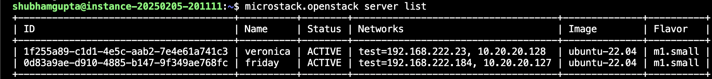
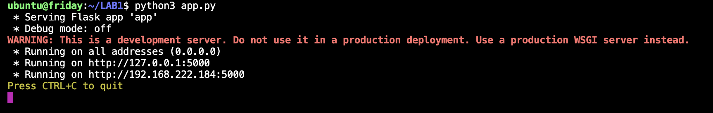
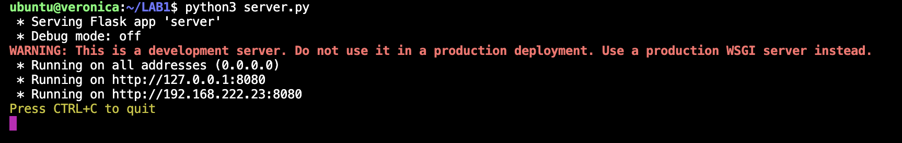
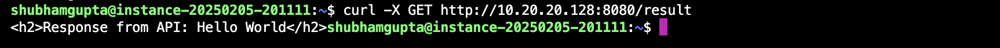

# Webserver

## 1. Create another instance


## 2. Install Flask on both instances

## 3. Install nginx on one of the instance (friday)
```bash
sudo apt install nginx
sudo systemctl start nginx
sudo systemctl enable nginx
```

## 4. Create a simple API in friday and run the server
- Refer to the file [app.py](friday/app.py)


## 5. Create a webform in veronica and run the server
- Refer to the file [server.py](veronica/server.py)


## 6. Add security rule to access the ports
```bash
microstack.openstack security group rule create --proto tcp --dst-port 8080 default
```

## 7. Check if the servers are able to communicate to each other
- On your GCP instance
```bash
curl -X GET http://10.20.20.128:8080/result
```

