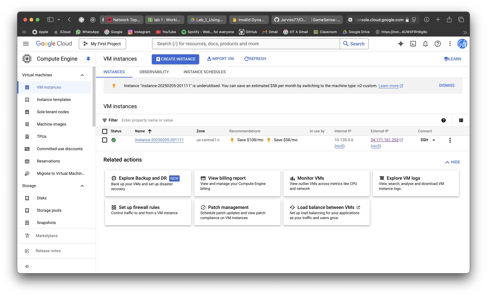

# Universal Setup 

## 1. Open Google Cloud Platform (GCP) Console
- Go to [Google Cloud Platform](https://console.cloud.google.com/)
- Sign in with your Google Account (Unused account to claim free credits)
- Create a new project

## 2. Create an instance
- Go to Compute Engine > VM Instances
- Create a new instance
- Select a n2-standard-2 machine type with 4vCPUs and 16GB memory and 100GB disk with CPU platform as at least **`Intel Broadwell`** (Supports Nested Virtualization)
- Ensure the boot disk is Ubuntu 22.04 LTS
- Allow HTTP and HTTPS traffic

## 3. Create a modified image ubuntu from the instance
- Add the nested virtualization liscense to the instance
- Create an image from the instance
- Refer to the [official documentation](https://cloud.google.com/compute/docs/instances/enable-nested-virtualization-vm-instances) for more details and this video for a [step-by-step guide](https://youtu.be/bqd0DzD_SBM?si=AJ-iCyRPxZ_2b6sR)

## 4. Create a new instance using the modified image
- Go to Compute Engine > VM Instances
- Create a new instance
- Select the image created in the previous step
- Select a n2-standard-2 machine type with 4vCPUs and 16GB memory and 100GB disk with CPU platform as at least **`Intel Broadwell`** (Supports Nested Virtualization)
- Allow HTTP and HTTPS traffic

## 5. SSH into the instance
- Download the gcloud terminal from the [official documentation](https://cloud.google.com/sdk/docs/install)

